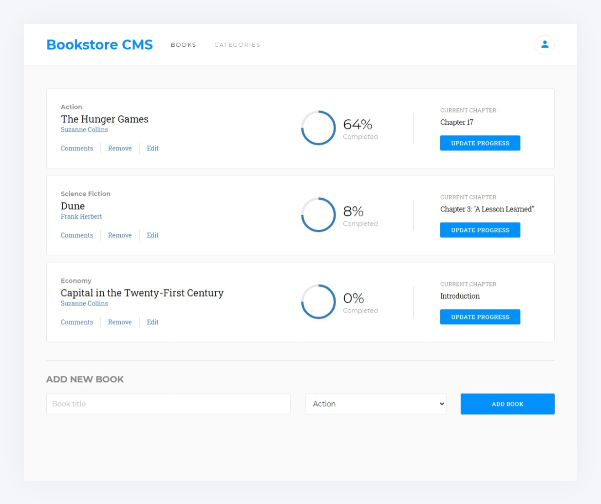

# Bookstore


> Book management website



The Bookstore website is a content management system that allows you to:

- Display a list of books
- Add a book
- Remove a selected book

## Built With

- React.Js
- CSS

## Live Demo

[Live Demo Link](https://usmansbk.github.io/bookstore)

## Getting Started

To get a local copy up and running follow these simple example steps.

### Prerequisites

- NodeJS - [v16.x](https://nodejs.org/en/)

### Setup

```bash
git clone https://github.com/usmansbk/bookstore.git
cd ./bookstore
```

### Install

```bash
npm install
```

### Usage

```bash
npm start
```

### Build

```bash
npm run build
```

### Run tests

```bash
npm test
```

## Authors

👤 **Babakolo Usman Suleiman**

- GitHub: [@usmansbk](https://github.com/usmansbk)
- LinkedIn: [LinkedIn](https://www.linkedin.com/in/usman-suleiman-82b444140/)

## 🤝 Contributing

Contributions, issues, and feature requests are welcome!

Feel free to check the [issues page](../../issues/).

## Show your support

Give a ⭐️ if you like this project!

## Acknowledgments

- Microverse
- [Microverse design team](https://app.zeplin.io/project/5b35a9e13227086040f8eb75/screen/5b695e29bb8c844f118f9378)

## 📝 License

This project is [MIT](./MIT.md) licensed.
